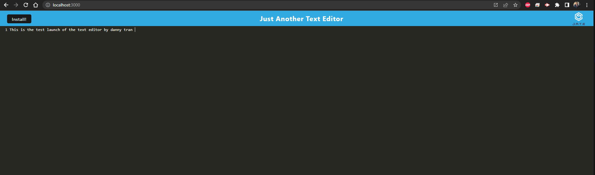
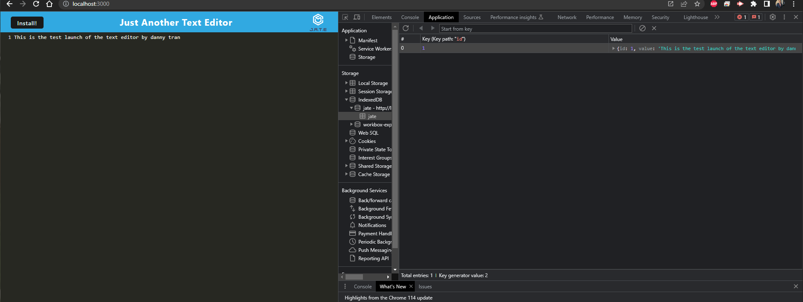
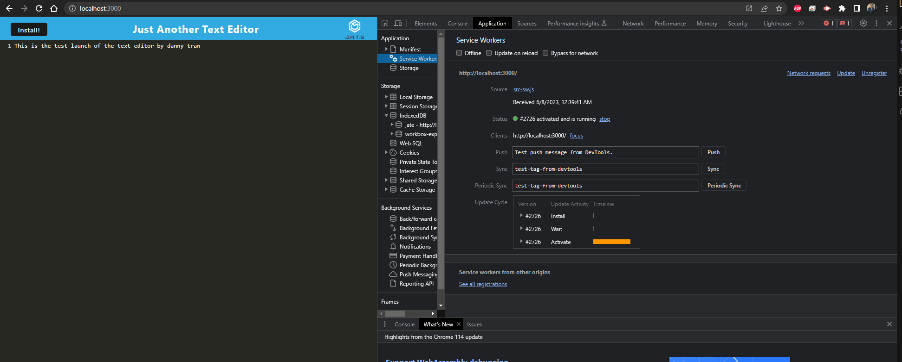
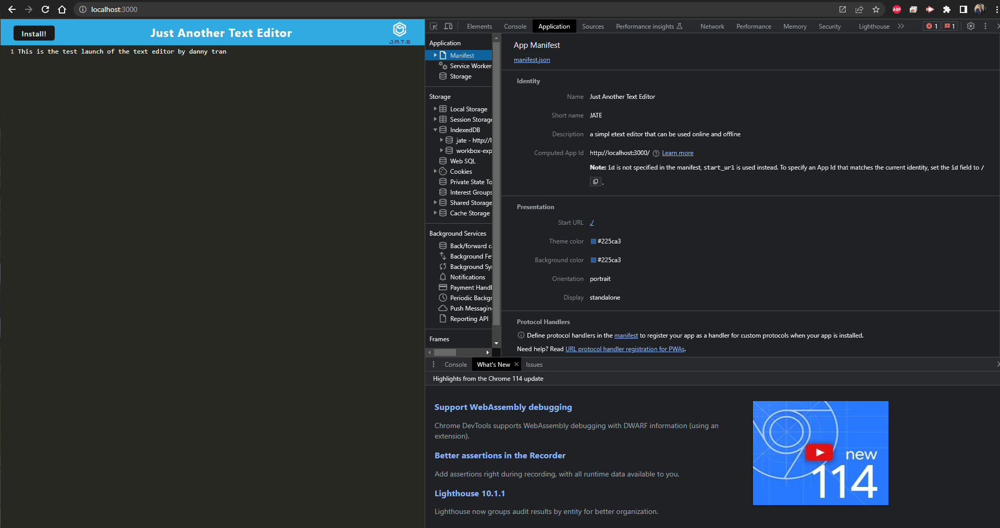

#  **PWA Text Editor**

## Description
    
This is a progressive web application text editor that generates a manifest.json and can work without internet connection. 
    
## Table of Contents 
    
- [Installation](#install)
- [Usage](#usage)
- [Credits](#credits)
- [License](#license)
- [Badges](#badges)
- [Features](#features)
- [Tests](#tests)
    
## Installation
  
- npm install 
- --save-dev @babel/plugin-proposal-object-rest-spread
- the second command line command is one that we ran into in class with our instructor. i added to to the package json but it never installed properly in class, so i just added this CLI command and it fixed the babel. 

    
## Usage
    
The user can download the repo, run the above CLI commands, then run npm run start and the progarm will run. Conversely, it will be on heroku until the course is over Juiy 8 2023.
    

       
    
## Credits
Module 19 was completed using lessons learned from week 19 PWA the following activities were referenced and modeled:
- 17/18 Caching
- 23/24 IndexedDB CRUD
- 25/26 Manifest
- Stu Mini-Project

## Questions

Project created by: [Daniel Tran](https://github.com/danieltran2016?tab=repositories)
You may directly reach my be contacting me at Danieltran2016@gmail.com.

    
## License

MIT License
   
Copyright (c) 2023 Danny Tran
    
Permission is hereby granted, free of charge, to any person obtaining a copy
of this software and associated documentation files (the "Software"), to deal
in the Software without restriction, including without limitation the rights
to use, copy, modify, merge, publish, distribute, sublicense, and/or sell
copies of the Software, and to permit persons to whom the Software is
furnished to do so, subject to the following conditions:
    
The above copyright notice and this permission notice shall be included in all
copies or substantial portions of the Software.
    
THE SOFTWARE IS PROVIDED "AS IS", WITHOUT WARRANTY OF ANY KIND, EXPRESS OR
IMPLIED, INCLUDING BUT NOT LIMITED TO THE WARRANTIES OF MERCHANTABILITY,
FITNESS FOR A PARTICULAR PURPOSE AND NONINFRINGEMENT. IN NO EVENT SHALL THE
AUTHORS OR COPYRIGHT HOLDERS BE LIABLE FOR ANY CLAIM, DAMAGES OR OTHER
LIABILITY, WHETHER IN AN ACTION OF CONTRACT, TORT OR OTHERWISE, ARISING FROM,
OUT OF OR IN CONNECTION WITH THE SOFTWARE OR THE USE OR OTHER DEALINGS IN THE
SOFTWARE.
    
---
    
## Badges
 

